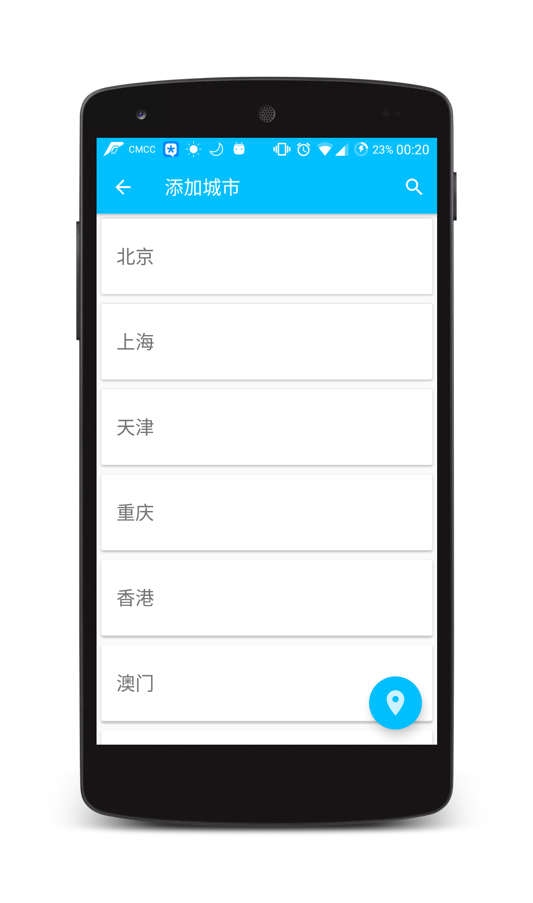
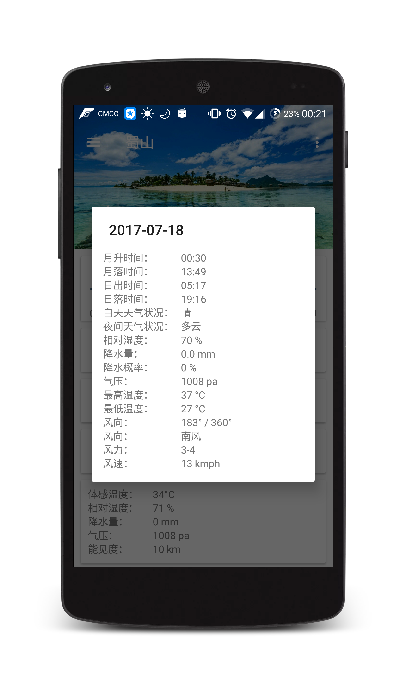
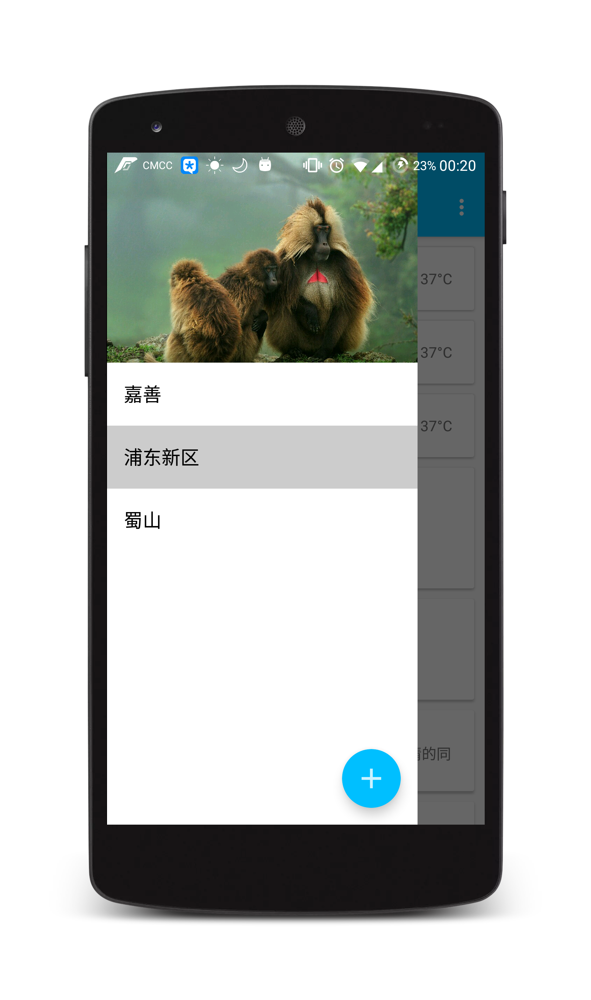
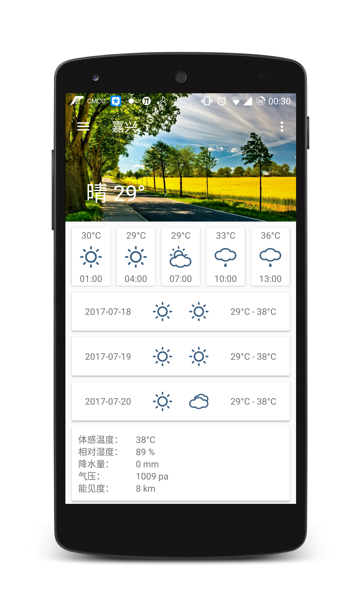
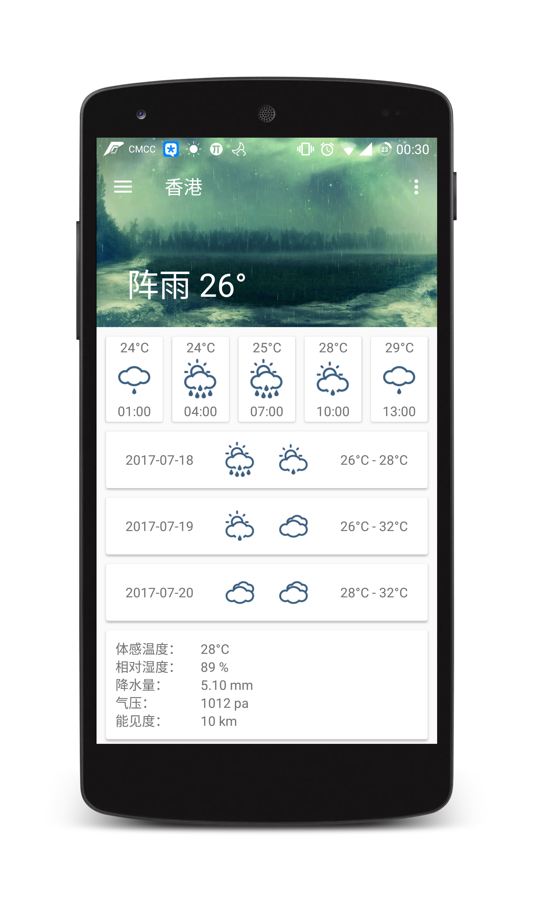
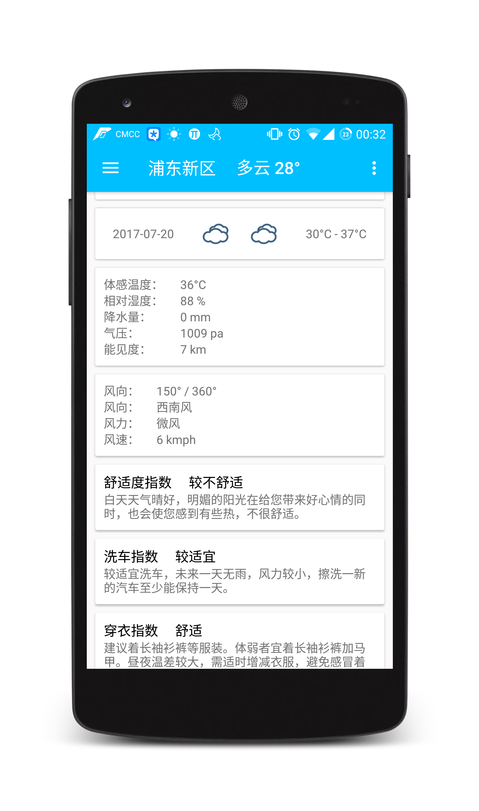

# MaterialWeather

MaterialWeather 是一款遵循 Material Design 风格的天气应用，主要有以下功能：

1、罗列全国所有的省、市、县；

2、定位当前城市，并查看天气信息；

3、查看所有城市的天气信息；

4、自由切换城市，查看其他城市的天气；

5、天气信息保存在本地缓存，没有网络的时候也可查看缓存的天气信息；

6、添加的城市可以拖动排序；

7、可以又滑删除已添加的城市;

8、下拉刷新天气。


## 截图









<br/><br/>
## License

```
Copyright 2017 Zackratos

Licensed under the Apache License, Version 2.0 (the "License");
you may not use this file except in compliance with the License.
You may obtain a copy of the License at

    http://www.apache.org/licenses/LICENSE-2.0

Unless required by applicable law or agreed to in writing, software
distributed under the License is distributed on an "AS IS" BASIS,
WITHOUT WARRANTIES OR CONDITIONS OF ANY KIND, either express or implied.
See the License for the specific language governing permissions and
limitations under the License.